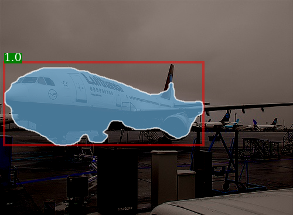
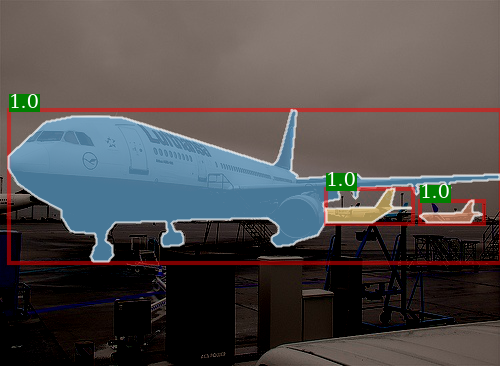

# WISE - BMVC 2019
## Where are the Masks: Instance Segmentation with Image-level Supervision
[[Paper]](https://arxiv.org/abs/1907.01430)

## Requirements

- Pytorch version 0.4 or higher.

## Description
Given a test image, the trained model outputs the instance masks in the image:



## Checkpoint for the weakly supervised mask rcnn
1. Download the checkpoint from here and add it to folder `checkpoints`:

https://drive.google.com/open?id=19aZJ3MQxZ3sdXlwAy4yK-TzFr4l88o7b

2. Evaluate the trained mask rcnn on the PASCAL validation set,

```
python test.py
```

## Test on a single image

Run a trained mask rcnn on a single image as follows:

```
python test_on_image.py
```

The expected output is shown below, and the output image will be saved in the same directory as the test image.

ground-truth           |  predictions
:-------------------------:|:-------------------------:
 |  


## Training

Run a mask rcnn on PASCAL 2012 with the following command:

```
python train.py
```

## Citation 
If you find the code useful for your research, please cite:

```bibtex
@article{laradji2019masks,
  title={Where are the Masks: Instance Segmentation with Image-level Supervision},
  author={Laradji, Issam H and Vazquez, David and Schmidt, Mark},
  journal={arXiv preprint arXiv:1907.01430},
  year={2019}
}
```
